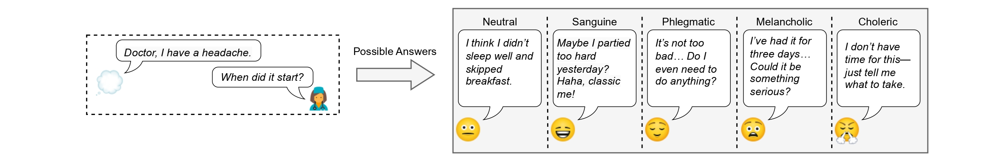

# 3MDBench: Medical Multimodal Multi-agent Dialogue Benchmark

[](https://arxiv.org/abs/2504.13861)

**3MDBench**, or **M**edical **M**ultimodal **M**ulti-agent **D**ialogue **Bench**mark, is an open-source benchmark for evaluating large vision-language models (LVLMs) through simulated doctor-patient dialogues. It features a Doctor Agent interacting with a temperament-driven Patient Agent using images and structured complaints. After that, an Assessor Agent, aligned with human experts, evaluates diagnostic and communication quality.



## How to run estimation

### Dependencies preparing

* Install dependencies from ```requirements.txt```
* Check out [the 3MDBench dataset on Hugging Face](https://huggingface.co/datasets/univanxx/3mdbench)!

---
### Dialogues generation

* Go to the ```scripts``` folder;
* Run ```run_dialogue.sh```, choosing models from used in the paper or implementing custom in the ```agents/doctor_agent.py``` file;

---
### Dialogues assessment

* Run ```run_assessment.sh``` to estimate generated dialogue, which will be contained in the ```results/assessments``` folder;
* Run ```run_diagnoses_obtaining.sh```to extract final diagnoses by Doctor Agent for each case, which will be contained in the ```results/assessments/diags``` folder;
* Explore ```benchmarking/count_metrics.ipynb``` to analyze model's metrics.

#### BibTeX reference
```
@misc{sviridov20253mdbenchmedicalmultimodalmultiagent,
      title={3MDBench: Medical Multimodal Multi-agent Dialogue Benchmark}, 
      author={Ivan Sviridov and Amina Miftakhova and Artemiy Tereshchenko and Galina Zubkova and Pavel Blinov and Andrey Savchenko},
      year={2025},
      eprint={2504.13861},
      archivePrefix={arXiv},
      primaryClass={cs.HC},
      url={https://arxiv.org/abs/2504.13861}, 
}
```
